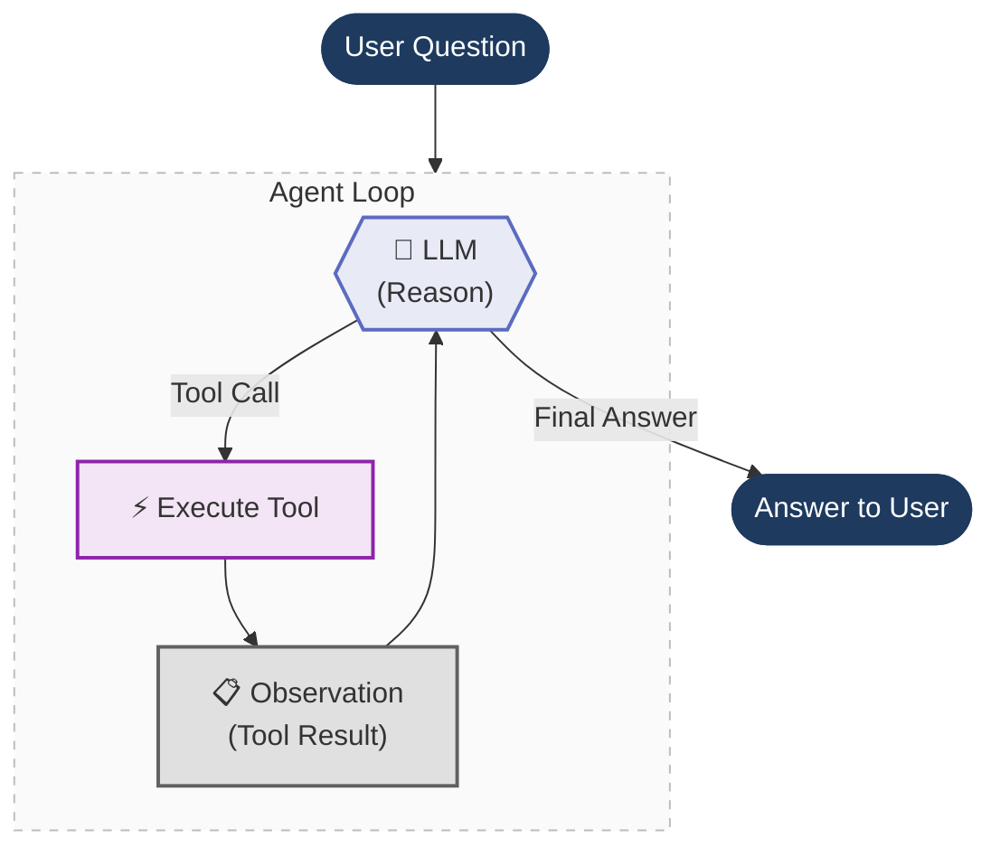

# Agents Under the Hood

The same tool-calling shopping-assistant agent, implemented three times at decreasing levels of abstraction, to show what an "agent" is actually doing underneath the framework.

```
┌─────────────────────────────────────────────┐
│  File 1: LangChain                          │  ← @tool, bind_tools(), ToolMessage
│  ┌────────────────────────────────────────┐  │
│  │  File 2: Raw Function Calling          │  │  ← Hand-written JSON schemas, ollama.chat()
│  │  ┌─────────────────────────────────┐   │  │
│  │  │  File 3: Raw ReAct Prompt       │   │  │  ← Prompt template, regex, scratchpad
│  │  └─────────────────────────────────┘   │  │
│  └────────────────────────────────────────┘  │
└─────────────────────────────────────────────┘
```

Each file is self-contained and runnable on its own.

## The agent loop

All three implementations share the same core loop — reason, pick a tool, execute it, observe the result, repeat until there's a final answer:



What changes across the three files is **how** each step is implemented:

| Step | File 1 (LangChain) | File 2 (Raw Function Calling) | File 3 (Raw ReAct) |
|------|------|------|------|
| **Reason** | LLM returns structured `tool_calls` | LLM returns structured `tool_calls` | LLM outputs text: `Thought: ... Action: ...` |
| **Parse** | `ai_message.tool_calls[0]` | `message.tool_calls[0].function` | Regex: `r"Action:\s*(.+)"` |
| **Execute** | `tool.invoke(args)` | `tools[name](**args)` | `tools[name](*args)` |
| **Observe** | Append `ToolMessage` | Append `{"role": "tool"}` dict | Append to scratchpad string |
| **Finish** | No tool calls in response | No tool calls in response | `"Final Answer:"` found in text |

## Implementations

### 1. LangChain tool calling
**File:** [`1_agent_loop_langchain_tool_calling.py`](1_agent_loop_langchain_tool_calling.py)

Two plain Python functions decorated with `@tool` — LangChain auto-generates the JSON schema from the function signature and docstring. The model is initialized with `init_chat_model(f"ollama:{MODEL}")` and tools attached with `bind_tools()`; the loop invokes the LLM, checks for tool calls, executes them, appends a `ToolMessage`, and repeats. Falls back to a clear error message if Ollama isn't running.

**Stack:** `langchain`, `langsmith` for tracing. Model: `qwen2.5:latest` via local Ollama.

### 2. Raw function calling (no LangChain)
**File:** [`2_agent_loop_raw_function_calling.py`](2_agent_loop_raw_function_calling.py)

The same agent built with only the `ollama` Python SDK — no LangChain. Tools are plain functions in a name→function dict; their JSON schemas are hand-written instead of auto-generated; messages and tool results are plain dicts (`{"role": "tool", "content": ...}`) instead of typed LangChain objects.

**Stack:** `ollama` SDK, `langsmith` for tracing. Model: `qwen2.5:latest` via local Ollama.

### 3. Raw ReAct prompt (no function calling, no LangChain)
**File:** [`3_raw_react_prompt.py`](3_raw_react_prompt.py)

Goes one layer deeper: no structured `tool_calls` API at all. Tools are described as plain text inside the prompt itself, and the LLM is instructed to follow the `Thought → Action → Action Input → Observation` format from the original [ReAct paper](https://arxiv.org/abs/2210.03629). The loop sends the accumulated scratchpad as a single message, stops generation at `\nObservation` so it can inject the real tool result, parses `Action:`/`Action Input:` out of the raw text with regex, and checks for `"Final Answer:"` to know when it's done. The ReAct prompt template is also pushed to the LangSmith Prompt Hub (`shopping-react-agent`) so it's versioned.

**Stack:** OpenAI API (`gpt-4o-mini`), `langsmith` for tracing and prompt versioning.

## The same agent, three ways

All three files answer the same question with the same tools:

> **"What is the price of a laptop after applying a gold discount?"**

- `get_product_price(product)` — looks up prices from a catalog (laptop: $1,299.99)
- `apply_discount(price, discount_tier)` — applies a named discount tier (gold: 23% off)

Expected flow: call `get_product_price("laptop")` → `1299.99`, call `apply_discount(1299.99, "gold")` → `1000.99`, return the final answer. Discount percentages are non-obvious (bronze: 5%, silver: 12%, gold: 23%) so the LLM can't guess — it has to use the tools.

## Running

```bash
git checkout project/agents-under-the-hood
uv sync

uv run python 1_agent_loop_langchain_tool_calling.py
uv run python 2_agent_loop_raw_function_calling.py
uv run python 3_raw_react_prompt.py
```

**Prerequisites:**
- Files 1 and 2: **Ollama** running locally with `qwen2.5:latest` pulled (`ollama pull qwen2.5:latest`)
- File 3: `OPENAI_API_KEY` in `.env`
- All three: `LANGSMITH_API_KEY` in `.env` (optional, for tracing)
