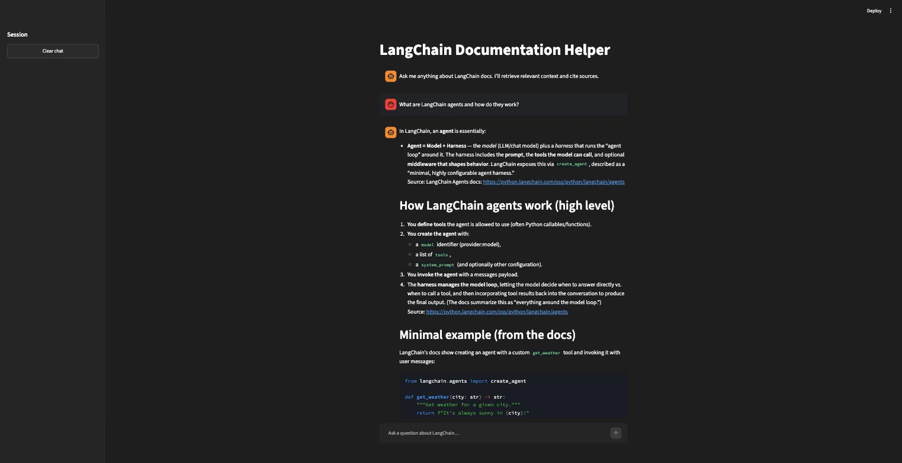

# 🦜 LangChain Documentation Helper

A RAG chatbot that answers questions about LangChain's documentation, with source citations.

[](https://www.python.org/downloads/)
[](https://langchain.com/)
[](https://streamlit.io/)
[](https://www.trychroma.com/)
[](https://tavily.com/)
[](LICENSE)

## What it does

**Ingestion** (`ingestion.py`): crawls `python.langchain.com` with Tavily (`TavilyCrawl`), splits the pages into ~4000-character chunks, embeds them with OpenAI (`text-embedding-3-small`), and stores them in a local Chroma vector store (`chroma_db/`).

**Retrieval + chat** (`backend/core.py`, `main.py`): `backend/core.py` builds a LangChain agent (`create_agent`) with a `retrieve_context` tool that searches the Chroma store for relevant doc chunks. `main.py` is a Streamlit chat UI — ask a question, it calls the agent, and shows the answer plus an expandable list of source URLs it pulled context from.

## Demo



## Tech stack

| Component | Technology |
|-----------|------------|
| Frontend | Streamlit |
| Agent framework | LangChain (`create_agent`) |
| Vector store | Chroma (local, file-based) |
| Web crawling | Tavily |
| LLM / embeddings | OpenAI |

## Quick start

### Prerequisites
- Python 3.11+
- `OPENAI_API_KEY` in a `.env` file (required to run `main.py`)
- `TAVILY_API_KEY` too if you want to (re-)run `ingestion.py`

### Setup

```bash
git clone https://github.com/epayaslii/langchain-project
cd langchain-project
git checkout project/documentation-helper

pip install -r requirements.txt

python ingestion.py   # crawls and indexes the docs into chroma_db/ (also needs TAVILY_API_KEY)
streamlit run main.py
```

Then open `http://localhost:8501`.

## Project structure

```
documentation-helper/
├── backend/
│   ├── __init__.py
│   └── core.py            # agent + retrieval tool
├── static/                 # logos, demo banner
├── chroma_db/              # local vector store (created by ingestion.py)
├── main.py                 # Streamlit chat UI
├── ingestion.py            # crawl + chunk + embed + index pipeline
├── consts.py
├── logger.py
├── Tavily Demo Tutorial.ipynb
├── Tavily Crawl Demo Tutorial.ipynb
└── requirements.txt
```

## Environment variables

| Variable | Required |
|----------|----------|
| `OPENAI_API_KEY` | ✅ (runtime) |
| `TAVILY_API_KEY` | Only for `ingestion.py` |

## License

MIT — see [LICENSE](LICENSE).

## Acknowledgements

This project was built while following Eden Marco's [LangChain](https://commencis.udemy.com/course/langchain/learn/lecture/49043719?learning_path_id=7785136#content) Udemy course, based on his original [langchain-course](https://github.com/emarco177/langchain-course) repository.
