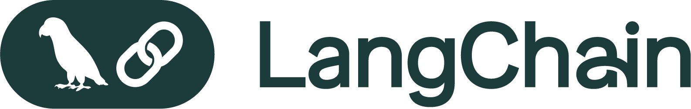

# Agentic RAG with LangGraph 🦜🔍

Implementation of Reflective RAG, Self-RAG & Adaptive RAG, built with LangGraph.

This repository is a refactored version of the original [LangChain Cookbook](https://github.com/mistralai/cookbook/tree/main/third_party/langchain)
by [Sophia Young](https://x.com/sophiamyang) from Mistral & [Lance Martin](https://x.com/RLanceMartin) from LangChain.

See the original YouTube video: [Advance RAG control flow with Mistral and LangChain](https://www.youtube.com/watch?v=sgnrL7yo1TE)


## Features

- **Refactored Notebooks**: The original LangChain notebooks have been refactored to enhance readability, maintainability, and usability for developers.
- **Production-Oriented**: The codebase is designed with a focus on production readiness, allowing developers to seamlessly transition from experimentation to deployment.
- **Test Coverage**: Comprehensive test coverage ensures the reliability and stability of the application, enabling developers to validate their implementations effectively.

## What You'll Learn

- **Agentic RAG Implementation**: Build a system that can make intelligent decisions about retrieving information
- **Graph-Based Control Flow**: Use LangGraph to create sophisticated control flows for your RAG pipeline
- **Document Relevance Evaluation**: Implement logic to grade document relevance and detect hallucinations
- **Adaptive Information Retrieval**: Create a system that can switch between local knowledge and web search
- **State Management**: Implement proper state handling for complex information flows

## Environment Variables

To run this project, you will need to add the following environment variables to your .env file:

```bash
OPENAI_API_KEY=your_openai_api_key_here
TAVILY_API_KEY=your_tavily_api_key_here  # For web search capabilities
LANGCHAIN_API_KEY=your_langchain_api_key_here  # Optional, for tracing
LANGCHAIN_TRACING_V2=true                      # Optional
LANGCHAIN_PROJECT=agentic-rag                  # Optional
```

> **Important Note**: If you enable tracing by setting `LANGCHAIN_TRACING_V2=true`, you must have a valid LangSmith API key set in `LANGCHAIN_API_KEY`. Without a valid API key, the application will throw an error.

## Getting Started

Clone the repository:

```bash
git clone https://github.com/epayaslii/langchain-project.git
cd langchain-project
git checkout project/agentic-rag
```

Install dependencies:

```bash
pip install -r requirements.txt
# or if using Poetry:
poetry install
```

## Prerequisites

- Python 3.10+
- Basic understanding of LLMs and RAG systems
- Familiarity with Python and vector databases (helpful but not required)

## Run Locally

Clone the project

```bash
  git clone https://github.com/epayaslii/langchain-project.git
```

Go to the project directory

```bash
  cd langchain-project
```

Install dependencies

```bash
  poetry install
```

Start the Agentic Rag flow

```bash
  poetry run main.py
```

## Running Tests

To run tests, run the following command

```bash
  poetry run pytest . -s -v
```

## Acknowledgements

Original LangChain Cookbook: [LangChain Cookbook](https://github.com/mistralai/cookbook/tree/main/third_party/langchain)
By [Sophia Young](https://x.com/sophiamyang) from Mistral & [Lance Martin](https://x.com/RLanceMartin) from LangChain

This project was built while following Eden Marco's [LangChain](https://commencis.udemy.com/course/langchain/learn/lecture/49043719?learning_path_id=7785136#content) Udemy course, based on his original [langchain-course](https://github.com/emarco177/langchain-course) repository.


